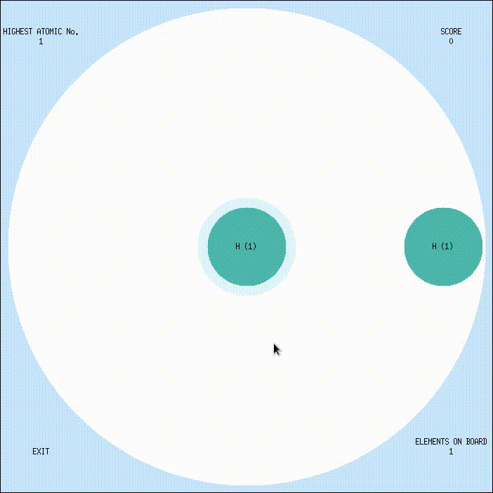
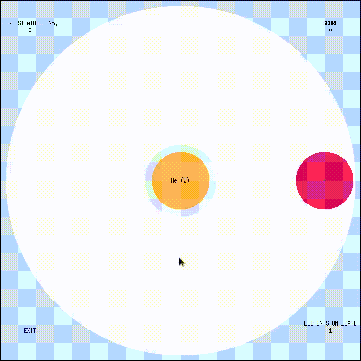
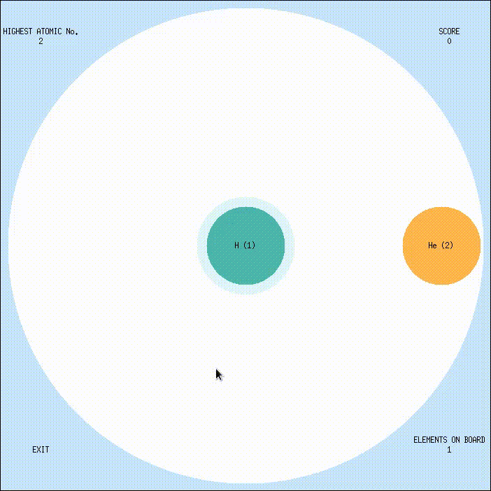
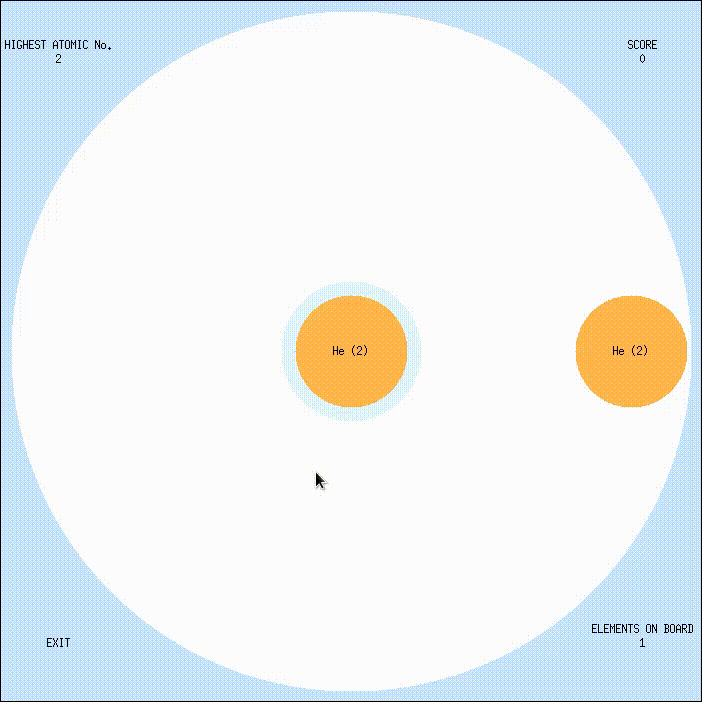
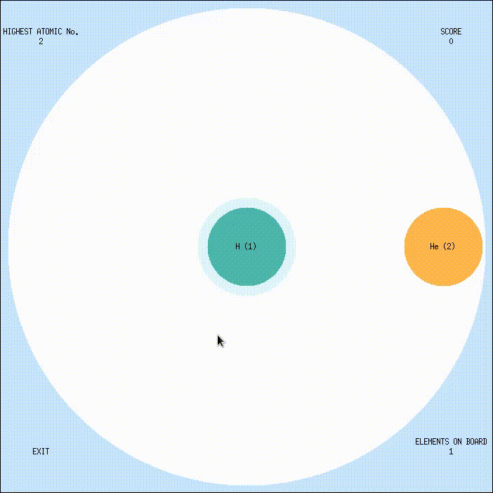

# fusion

## description
- Fusion is a circular variant of [tetris](https://en.wikipedia.org/wiki/Tetris).

## code
- The code is written in `C++`.
- All the source code is in `src/`.
- Any generated outputs are stored in `data/`.
- [Simplecpp](https://www.cse.iitb.ac.in/~ranade/simplecpp/) is used for rendering.
- `include` & `lib` contains headers and implementation of simplecpp.

## documentation
- The documentation for the code is itself.

## usage

### how to run? [linux]
- Make sure x11 and x11-dev are installed.
- Open terminal in the root directory.
    - Make a build directory using `mkdir build && cd build`.
    - Create a makefile using `cmake ..`
    - Compile code using `make`. This creates an executable named `fusion`.
    - Use `./fusion` to start playing.

### rules
- The game board is circular.
- An element (from the periodic table) pops up in the center randomly.
- It can be placed anywhere on the circular board with a mouse click. Once placed, the ones on the board space themselves out equally.
- As one element is placed, a new element pops up again in the center.
- Sometimes a special element `+` pops up.
    - Once placed in circle, It has the power to fuse elements.
    - But for fusion to occur elements on either side of `+` should be mirror images.
    - For example, if board has `H (1)` `+` `H (1)`, then both `H` fuse to give `He (2)`.
    - More than one pair of elements can be fused at a time.
    - For example, `He (2)` `H (1)` `+` `H (1)` `He (2)` gives `Be (4)`.
    - Bigger combos generate bigger elements.
    - Even `+`'s can be fused. `+` `+` `+` gives `H (1)`.
- Every time a fusion occurs you get some points based on the size of the combo.
- Notice the number of elements decrease when fusion occurs.
- If the number of elements on the board exceed `12` the game ends.
- So the goal is to keep the fusion going and prevent that.
- Place, fuse and repeat to score the highest.
- Scores are recorded in a file. For this a you will be prompted to enter a handle at the beginning.
- Concept taken from [Atomas](https://play.google.com/store/apps/details?id=com.sirnic.atomas&hl=en_US).

## demonstration
The following gifs illustrates the gameplay.

- Single fusion `H (1)` `+` `H (1)` => `He (2)`.

- Single fusion `He (2)` `+` `He (2)` => `Li (3)`.

- Multi fusion `He (2)` `H (1)` `+` `H (1)` `He (2)` => `Be (4)`.

- Multi fusion `He (2)` `He (2)` `+` `He (2)` `He (2)` => `B (5)`.

- Multi fusion `He (2)` `H (1)` `+` `H (1)` `He (2)` => `Be (4)`.

- Bad placement.

- Full gameplay.

## roadmap
- [x] Basic game.
    - [x] rayAngle()
    - [x] 120 element symbols and colors.
    - [x] Decouple file i/o from game logic.
    - [x] Bubbling effect while fusing.
    - [x] Implement good data structure for maintaining game state. Round Table Conference Structure i.e. Circular double linked list.
    - [x] Random new atomic number based on max atomic number achieved. Use normal dist with mean = 0.5 max achieved, std = 1.
- [x] Fix high score logic.
- [ ] Improve game experience.
    - [x] Highest Element achieved.
    - [x] Element Symbol.
    - [x] Score.
    - [x] Randomness.
    - [x] \+ element.
    - [x] Colors.
    - [ ] Place the first element on top instead of right side.
    - [ ] It's better to provide a restart option after game-over instead of closing the window.
    - [ ] Show the scoreboard on the terminal along with current score and rank.
- [x] Close canvas properly.
- [ ] Fix stoi bug.
